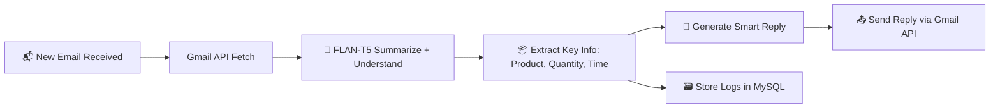

# 🤖 Smart Email Bot using FLAN-T5-Large, Gmail API & FastAPI


---

## 📌 Overview

This is a powerful **AI-powered Email Bot** designed to parse, understand, and respond to customer emails in real-time using Google’s **FLAN-T5-Large** model. It integrates with Gmail via OAuth, extracts structured order information from emails, and sends intelligent, automated replies. All email interactions are logged into a **MySQL database**.

> ⚡ Built for smart business automation and real-world AI deployments.

---

## 🔍 Features At a Glance

* 🔐 Gmail OAuth2 secure login
* 📥 Fetches unread client emails
* 🧠 Uses FLAN-T5-large for summarization + reply generation
* 🗃️ Logs both raw & processed data into MySQL
* 📦 Extracts product names, quantities, delivery locations, and times
* 💬 Auto-generates polite, contextual responses
* ⏱️ Runs every 5 seconds using APScheduler
* 🧪 Easy to test and expand for future business cases

---

## 🖼️ System Architecture



---

## ⚙️ Tech Stack

| Layer           | Technology                         |
| --------------- | ---------------------------------- |
| 📬 Email Client | Gmail API + OAuth2                 |
| 🧠 NLP Model    | FLAN-T5-large (Hugging Face)       |
| 🧾 Framework    | FastAPI                            |
| 🗃️ Database    | MySQL                              |
| ⏱️ Scheduler    | APScheduler                        |
| 🔐 Auth         | `auth_gmail.py` for token handling |
| 🧪 Dev Tools    | Logging, .env config, testing mail |

---

## 🚀 How It Works

1. **Scheduler (APScheduler)** runs every 5 seconds
2. **Unread emails** are fetched from Gmail inbox
3. The email **body is passed to FLAN-T5** to:

   * Summarize content
   * Extract intent and order details
4. Parsed info (product, delivery location & time) is saved to **MySQL**
5. A **smart reply** is auto-generated and sent back

---

## 📦 Setup Instructions

### 🔧 1. Clone & Install

```bash
git clone https://github.com/your-username/email-bot.git
cd email-bot
pip install -r requirements.txt
```

### 🔑 2. Gmail Auth Setup

* Create credentials from Google Cloud Console
* Enable Gmail API
* Place `token.json` and `credentials.json` inside the root directory

### ⚙️ 3. Environment Variables

Create a `.env` file:

```env
EMAIL_ADDRESS=yourbot@gmail.com
DB_HOST=localhost
DB_NAME=email_logs
DB_USER=root
DB_PASSWORD=yourpassword
```

### 🧠 4. Download FLAN-T5-Large

```python
from transformers import AutoTokenizer, AutoModelForSeq2SeqLM
model_name = "google/flan-t5-large"
tokenizer = AutoTokenizer.from_pretrained(model_name)
model = AutoModelForSeq2SeqLM.from_pretrained(model_name)
```

### ▶️ 5. Run the Bot

```bash
python main.py
```

---

## 🧪 Sample Email

> Subject: Order Request – Urgent
>
> Hello, I’d like to order 20kg of basmati rice and 10kg of sugar.
> Please deliver it to 45 Lotus Street, Bengaluru by Friday 10AM. Thanks.

### 🧠 Bot Response:

```text
Hello,

Thank you for your order! We’ve received your request for:
- 20 kg Basmati Rice
- 10 kg Sugar

Your order will be delivered to 45 Lotus Street, Bengaluru by Friday 10:00 AM.

Regards,
SmartBot
```

---

## ⚠️ Developer Note on Interval

> ⏱️ **IMPORTANT:** This bot is set to run every **5 seconds** for testing. In production, you should **increase it to 60 seconds or more** to avoid:
>
> * Gmail API rate limits
> * Excessive token usage

Update it in your `main.py`:

```python
scheduler.add_job(job_function, 'interval', seconds=5)
```

---

## 📊 MySQL Log Structure

| Field             | Type     | Description                 |
| ----------------- | -------- | --------------------------- |
| id                | INT (PK) | Unique log ID               |
| sender            | VARCHAR  | Email sender                |
| subject           | TEXT     | Email subject line          |
| original\_content | TEXT     | Raw email body              |
| product           | TEXT     | Extracted product(s)        |
| quantity          | TEXT     | Extracted quantity          |
| delivery\_address | TEXT     | Extracted delivery location |
| delivery\_time    | TEXT     | Extracted delivery time     |
| response          | TEXT     | Bot-generated response      |
| timestamp         | DATETIME | Logged timestamp            |

---

## 📈 Future Improvements

* 🔄 Improve product catalog mapping
* 🌐 Add multi-language support
* 🧠 Fine-tune on business-specific order emails
* 🧾 Add PDF invoice generation & attachment
* 🛡️ Retry failed replies / bounce detection

---

## 👤 Author

> Built with 💙 by **Jessie Lawson**

* GitHub: https://github.com/JessieLawsonsir
* LinkedIn: https://www.linkedin.com/in/jessie-lawson-028282317/

---

## 📜 License

```
MIT License

Copyright (c) 2025 Jessie Lawson

Permission is hereby granted, free of charge, to any person obtaining a copy
of this software and associated documentation files (the "Software"), to deal
in the Software without restriction...
```

---

## 🙌 Contribute

If you’d like to contribute, fork this repo, make changes, and submit a PR.
For major changes, please open an issue first to discuss your ideas!

> Star ⭐ this repo if it helped you!

---

## 🧠 Observe the way I observe.

> *“Intelligence means observing the unseen, not just automating the obvious.”*
